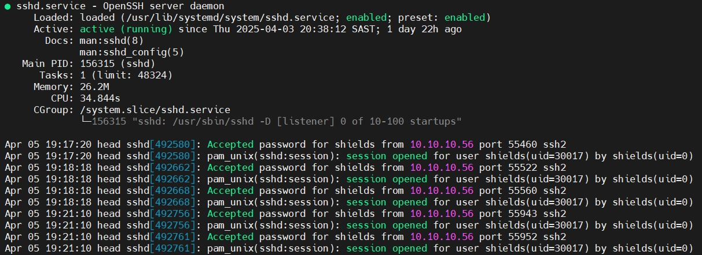
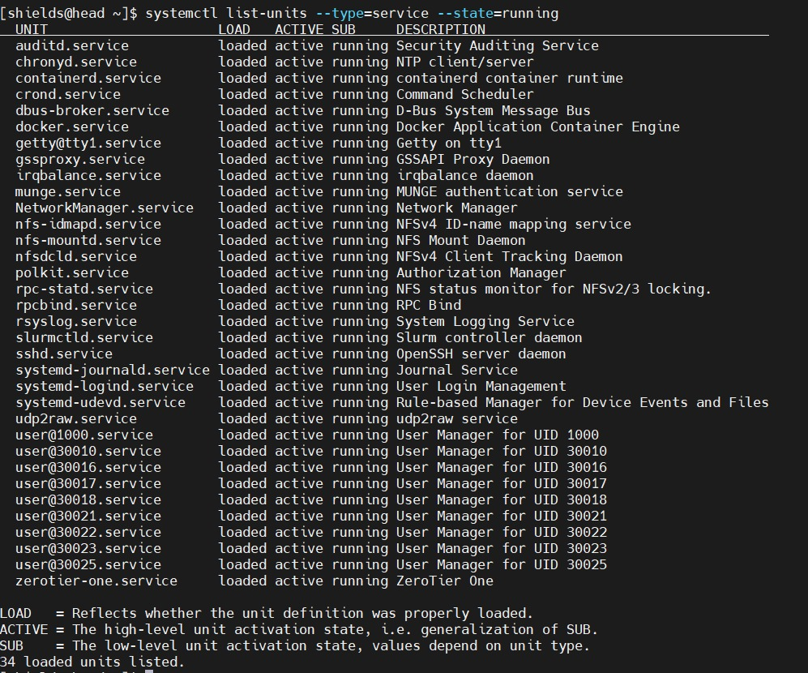
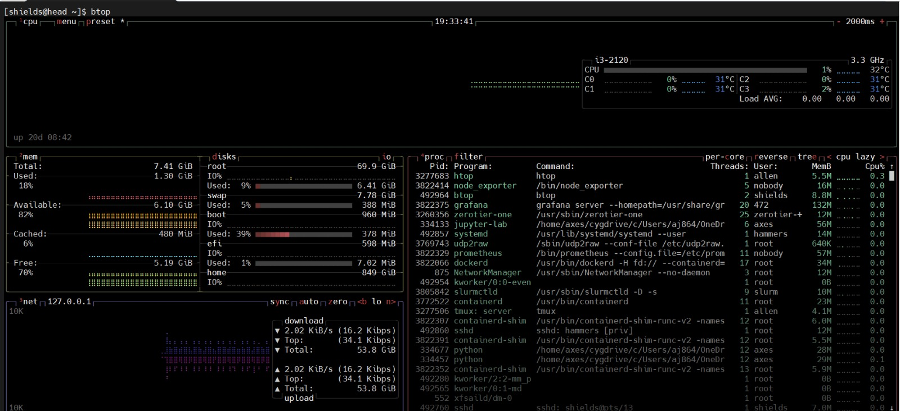
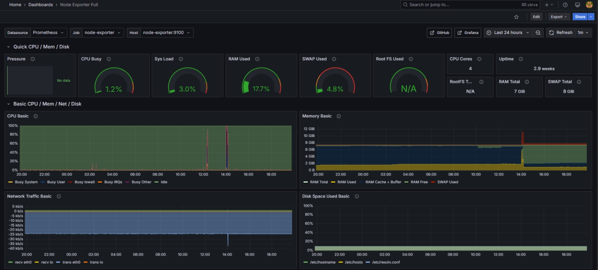
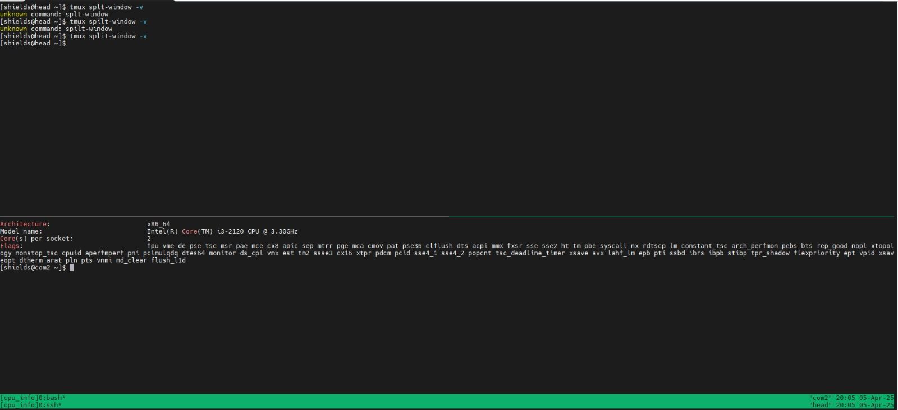
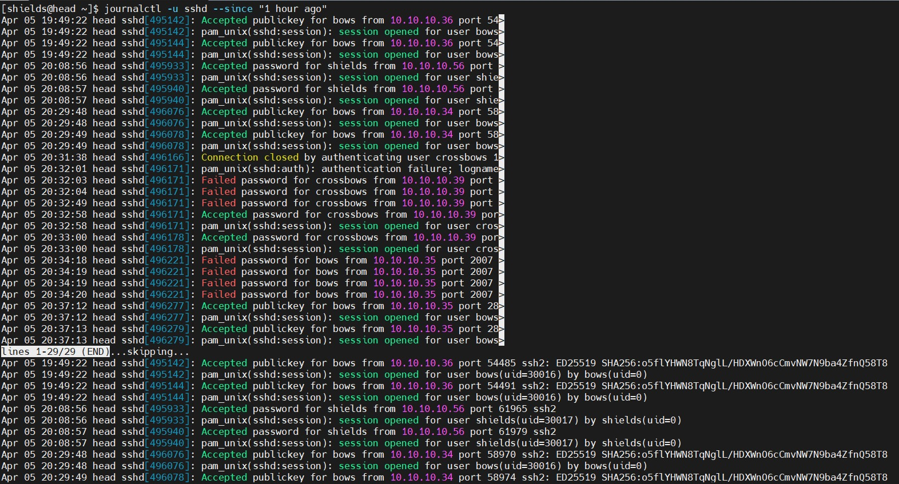

# Shields tutorial 2 answers

## Question 1:

Get the status of the SSH service on the head node:

```bash
#'Systemctl' accesses and manages the services in Linux, the 'status sshd' lists the statuses of the SSH services

systemctl status sshd
```
Our results printed out:



## Question 2:

Using systemctl, get the list of all running services on the head node:

```bash
#'--type==<item or object>' specifies the type of object or item to be indentified
#'--state==<specified status>' identifies the condition such as running or inactive statuses

systemctl list-units --type=service --state=running
```
Our results printed out:



## Question 3:

Using htop or btop on com1 or com2, identify the SSH process:

```bash
#We used btop which monitors use of resources

btop
```
Our results printed out:



## Question 4:

Our task: Using your browser on your laptop/PC, access the Grafana dashboard at 155.238.172.16:3000 and take a screenshot of the "node-exporter:9100" host. username = admin ; password = captain_password

The results from our commands and commands used:

```bash
# IP address is used to access Dashboard of cluster remotely

10.10.10.10:3000
```
 

## Question 5:

Use lscpu and the grep command to get the CPU details of head and com2. Use tmux to display both windows of head and com2 simultaneously. Show the following details: architecture, number of cores, and CPU flags.

The results from our commands and commands used:

```bash
#CPU details are accessed

lscpu | grep -E 'Architecture|Core|Flags'

#Window is split

tmux split-window -v
```
 

## Question 6:

Use journalctl (on the head node) to retrieve all SSH logs from the last hour:

```bash
#Displays recent SSH logs within the hour
journalctl -u sshd --since "1 hour ago"
```


```
